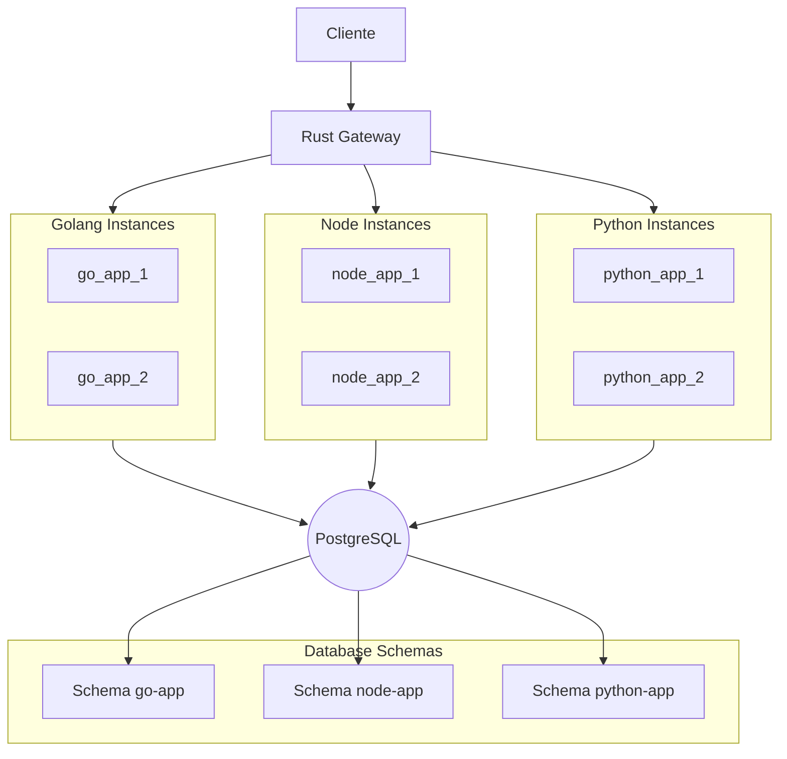

# Trabalho Ubiquitous - API Gateway + Microservices

Sistema distribuído com API Gateway em Rust e microserviços backend.

## Arquitetura



### Componentes

| Componente     | Tecnologia        | Porta          | Descrição                                      |
| -------------- | ----------------- | -------------- | ---------------------------------------------- |
| Gateway        | Rust (Axum)       | 8080           | Rate limiting, circuit breaker, load balancing |
| Go API         | Golang (Gin)      | 8081           | CRUD de usuários                               |
| Node.js API    | Node.js (Express) | 8082           | CRUD de usuários                               |
| Python API     | Python (FastAPI)  | 8083           | CRUD de usuários                               |
| Database       | PostgreSQL 12     | 5432           | Persistencia dos dados                         |

## Testando o sistema

1. Testando o Gateway Health
   ```bash
    curl http://localhost:8080/
    ```
   Resposta esperada:
   ```json
    {
        "upstreams": ["http://go_app:8000", "http://node_app:8000", "http://python_app:8000"],
        "circuit_breakers": ["closed"],
        "rate_limit": 30,
        "window_sec": 60
    }
    ```
   
2. Testando o Proxy para a API em Go
    ```bash
    # Listar usuários através do gateway
    curl http://localhost:8080/users
    ```
3. Testando o Rate Limiting
    ```bash
    # Fazer 35 requests rápidas (limite é 30)
    for i in {1..35}; do 
    curl -s -o /dev/null -w "Request $i: %{http_code}\n" http://localhost:8080/users
    done
    ```
4. Testando o Circuit Breaker
    ```bash
    # Parar a Go API
    docker stop go_app

    # Fazer requisições (deveria abrir o circuit após 3 falhas)
    for i in {1..5}; do 
    curl http://localhost:8080/users
    done

    # Iniciar novamente
    docker start go_app
    ```
